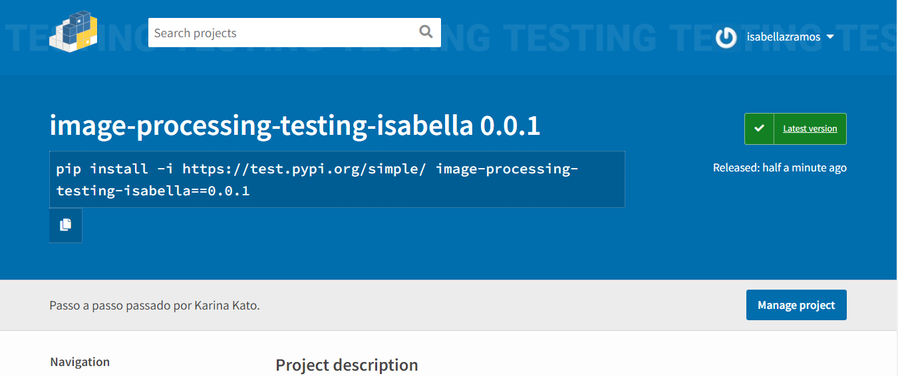
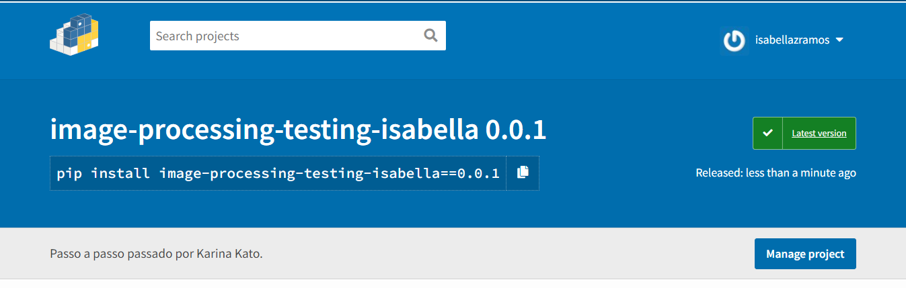

# Pacotes
## Passos para subir o pacote

1. Criar conta no Test Pypi;
2. Publicar no Test Pypi;
3. Instalar o pacote usando Test Pypi;
4. Testar pacote;
5. Criar conta no Pypi;
6. Publicar no Pypi;
7. Instalar pacote usando Pypi.

## Comando para publicar no Test Pypi

``` 
	python -m twine upload --repository-url https://test.pypi.org/legacy/ dist/*
```

### Publicação Test Pypi



### Comando para instalar o pacote de teste

``` 
	pip install -i https://test.pypi.org/simple/ image-processing-testing-isabella==0.0.1
	
```

## Comando para publicar no Pypi

``` 
	python -m twine upload --repository-url https://upload.pypi.org/legacy/ dist/*
	
```

### Publicação Pypi


### Comando para instalar o pacote de teste

``` 
	pip install image-processing-testing-isabella==0.0.1
	
```

